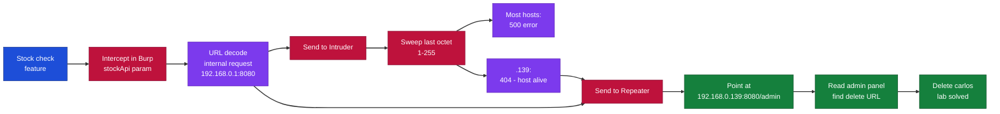
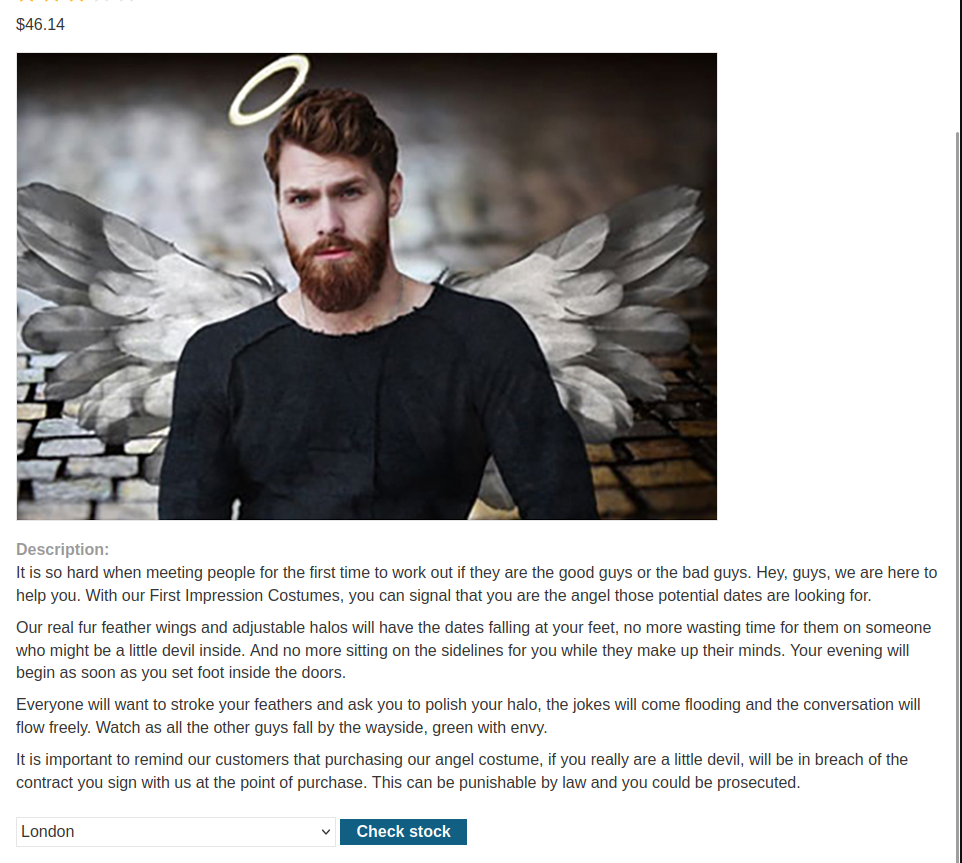
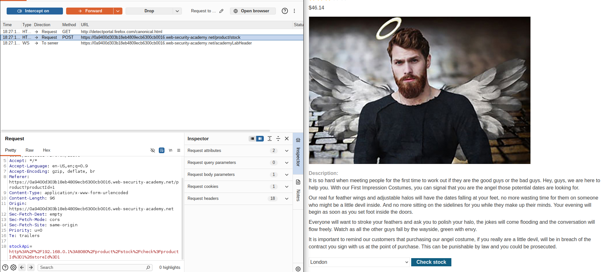
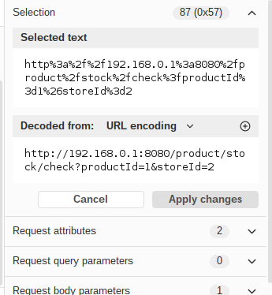
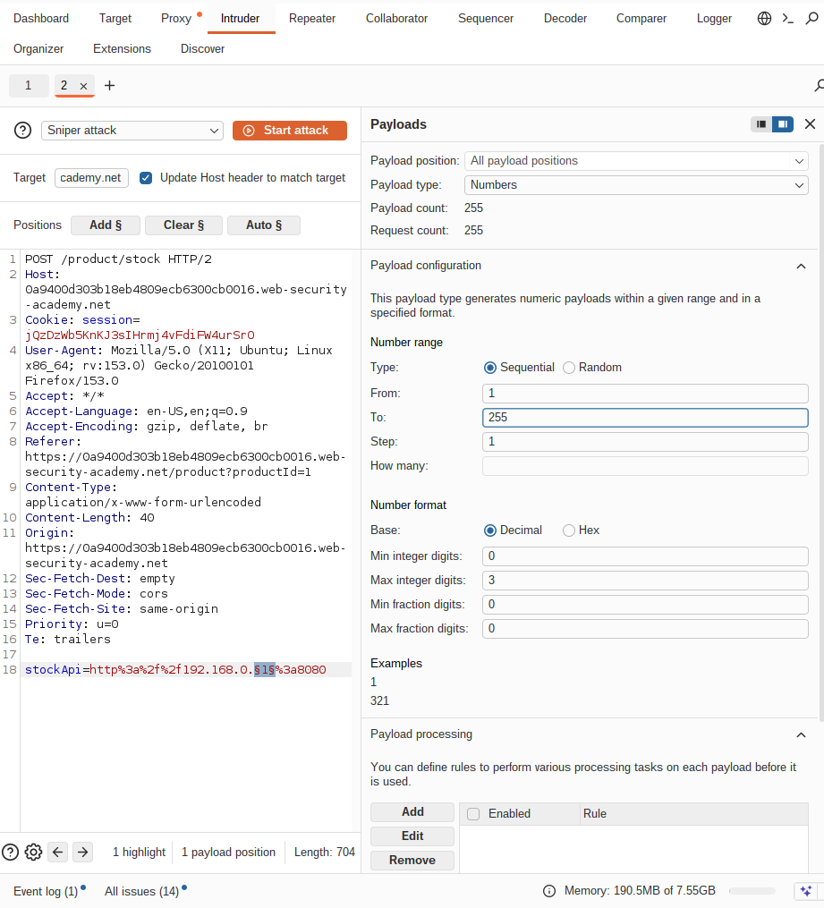
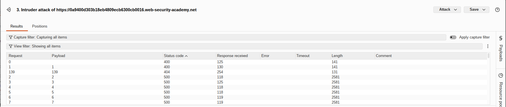
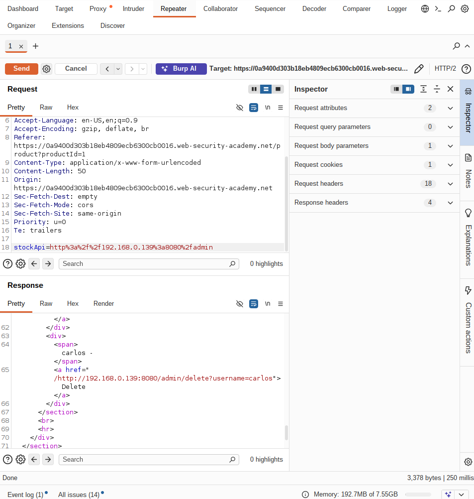

# PortSwigger - Basic SSRF Against Another Back-End System | Write-up

> **Platform:** PortSwigger &nbsp;•&nbsp; **Category:** Server-Side Request Forgery (SSRF) &nbsp;•&nbsp; **Difficulty:** Apprentice (Easy)
>
> **Target:** `192.168.0.0/24:8080` (internal)
>
> **Author:** Jithin Jelson

---

## Introduction

In this lab we have been told that a stock check feature is vulnerable to SSRF. The stock check feature checks data from an internal server. We have been instructed to scan the internal 192.168.0.x range for an admin interface on port 8080 and delete the user carlos.

---

## Assessment Overview

---

## What I Learned

- How a stock check feature that fetches data from an internal server can be abused to reach systems the client should never touch.
- Using Burp's decoder to unwrap a URL encoded parameter and see the real request being made behind the scenes.
- Running Burp Intruder to sweep an internal 192.168.0.x range and pick out the one host that answers differently.
- Reading response codes carefully, so a 404 or an internal server error tells me whether a host is present and whether the client is simply unauthorised.
- Pivoting the discovered internal request into Repeater to hit the admin panel directly through the SSRF.

---

## Finding the Stock Check Request

So first we can visit the page where this stock check functionality is available and fire up Burp.

*Figure 1 - The product page with the stock check feature that talks to an internal server.*

Now we can turn on intercept and check for the request being sent to the internal system.

*Figure 2 - The intercepted request, with the internal URL held in a URL encoded stockApi parameter.*

We can see that it is URL encoded so we can decode it to see what the request is clearly.

*Figure 3 - Decoding the parameter reveals the request going to an internal host on port 8080.*

---

## Scanning the Internal Range

We can see it clearly now. The question tells us it can be anywhere in the IP range 192.168.0.x so we can send this to Intruder.

In Intruder we can send the attack onto the number 1 and create a list from 1-255 that scans the entire network to see which one of it gives us a response.

*Figure 4 - Intruder sweeping the last octet from 1 to 255 across the internal range.*

We seemed to have gotten an internal server error for every IP range except 139 so we can try use SSRF to get into the admin panel this way, as 404 just means we are unauthorised from the client side.

*Figure 5 - Host .139 stands out from the rest of the range with a different response.*

---

## Reaching the Admin Panel and Solving

So we can send this to Repeater.

*Figure 6 - Pointing the stockApi request at 192.168.0.139:8080/admin reaches the internal admin interface.*

Now we can see the URL required to delete the user so we can put this into our stock API and solve the lab.

*Figure 7 - Sending the delete request for carlos through the SSRF solves the lab.*
