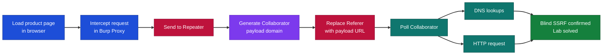
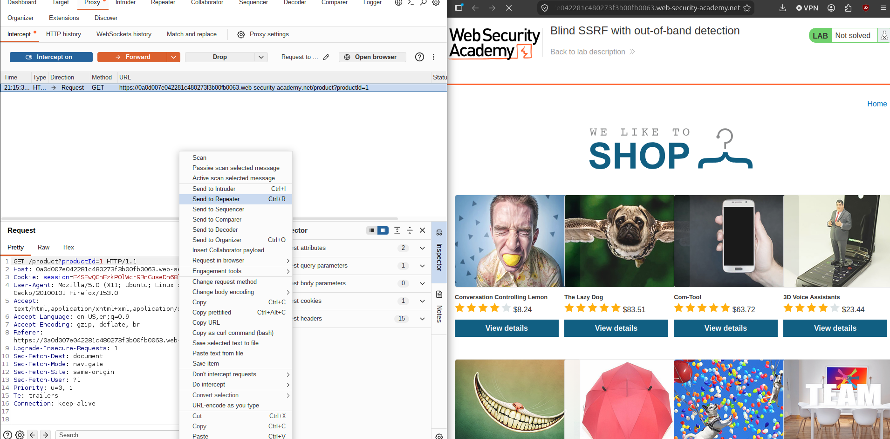
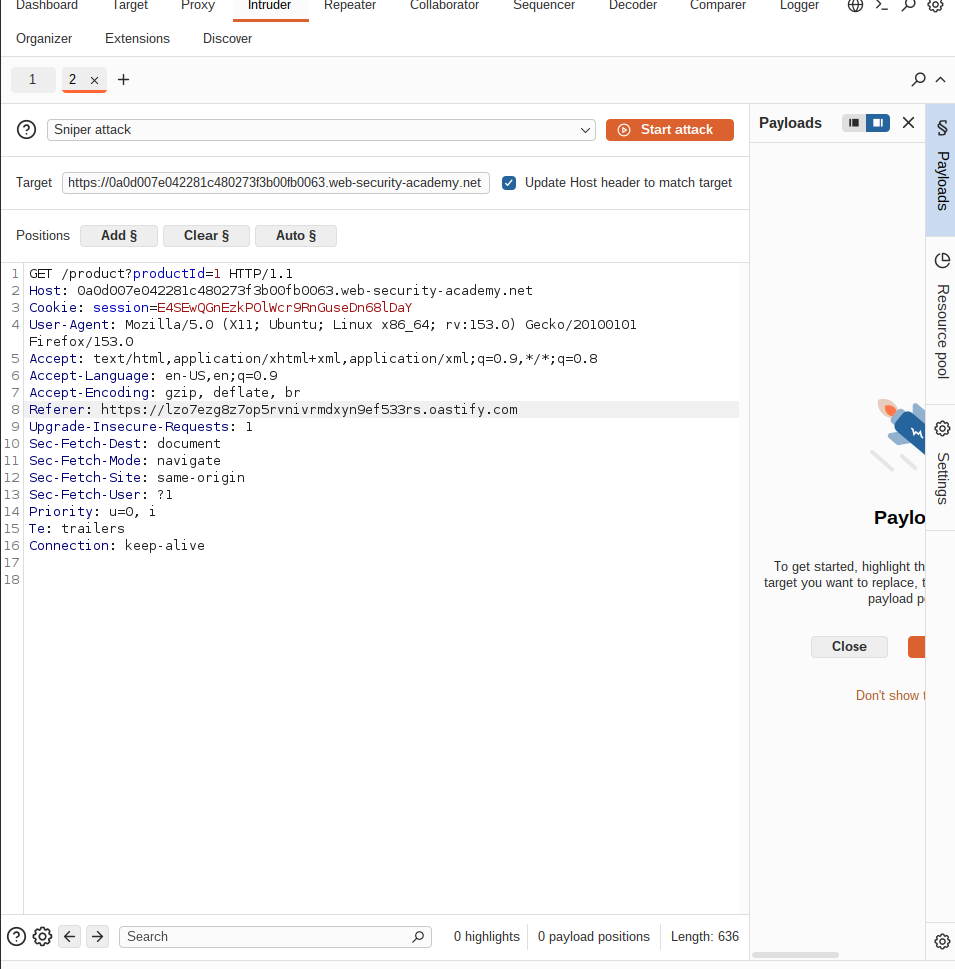
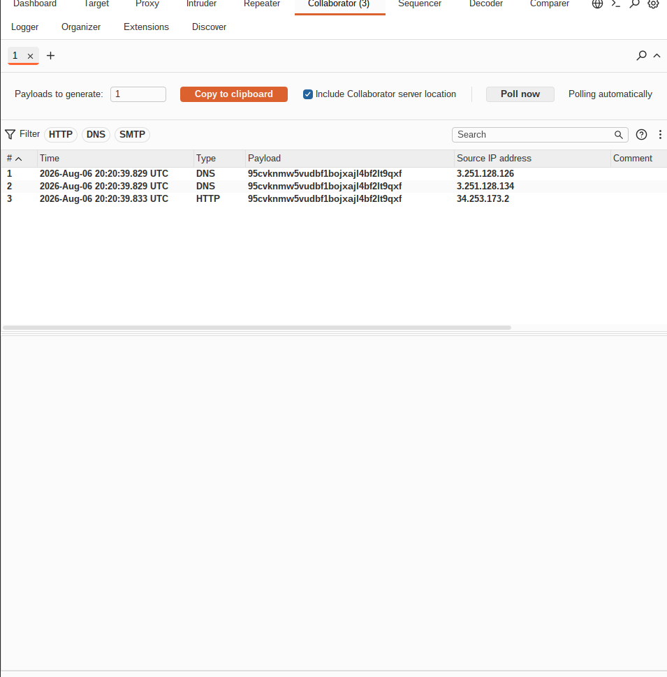

# PortSwigger Web Security Academy - Blind SSRF with Out-of-Band Detection | Write-up

> **Platform:** PortSwigger Web Security Academy &nbsp;•&nbsp; **Category:** Server-Side Request Forgery (SSRF) &nbsp;•&nbsp; **Difficulty:** Practitioner
>
> **Target:** `0a0d007e042281c480273f3b00fb0063.web-security-academy.net` &nbsp;•&nbsp; **Time taken:** 10 minutes
>
> **Author:** Jithin Jelson

---

## Introduction

We have been told that this site uses analytics software which fetches the URL specified in the Referer header when a product page is loaded. To solve this lab we have to cause an HTTP request to the public Burp Collaborator server.

It is "blind" because the server makes the request for us but never shows us the response, so instead of reading it back we point the server at a domain we control and watch for it to reach out.

---

## Assessment Overview



---

## What I Learned

- How blind SSRF differs from normal SSRF, so the response never comes back and I have to prove the request another way.
- Using out-of-band (OAST) techniques with Burp Collaborator to catch a request the server makes on my behalf.
- Why the Referer header is an attack surface, because analytics software often visits any URL that appears in it.
- Reading Collaborator interactions and telling a DNS lookup apart from a full HTTP request.
- That a single hit from the target confirms the bug, even with nothing in the response.

---

## Intercepting the Product Request

So we can start by accessing the lab and booting up Burp. We can turn Intercept on and intercept the product loading page. Once it is caught, we can send it to Repeater so we can edit and replay it. The Referer header still points at the normal lab domain here, which is the header we are about to change.



*Figure 1 - Intercepting the product page request and sending it to Repeater.*

---

## Inserting the Collaborator Payload

We can send this to Repeater to help make a request to our Burp Collaborator server. We can copy to clipboard and replace the Referer URL with our URL. That URL is a unique Collaborator domain, so anything that hits it can only have come from the target.

```
Referer: https://lzo7ezg8z7op5rvnivrmdxyn9ef533rs.oastify.com
```



*Figure 2 - The Referer header replaced with our Burp Collaborator payload domain.*

---

## Confirming the Blind SSRF

Now when we send this in Repeater we can poll now on Collaborator, and we can see that we have successfully done it. We get a couple of DNS lookups and a full HTTP request back from the target, and that HTTP hit is what confirms the server really made the request out-of-band.



*Figure 3 - Collaborator receives DNS lookups and an HTTP request from the target, confirming the SSRF.*


*Figure 4 - Lab solved after triggering the out-of-band HTTP request.*
