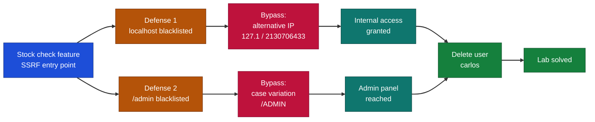
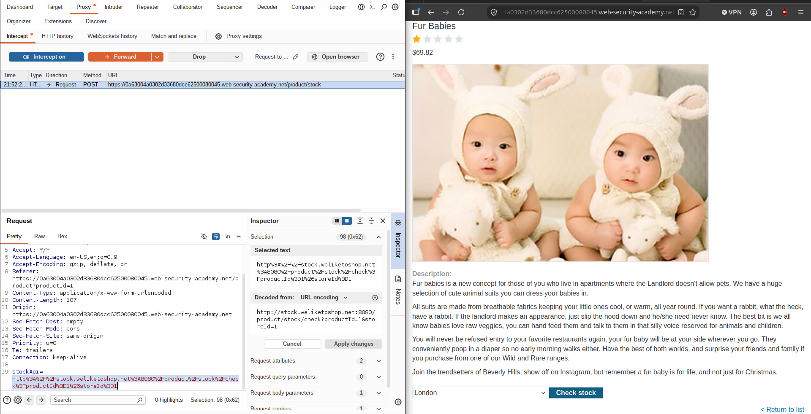
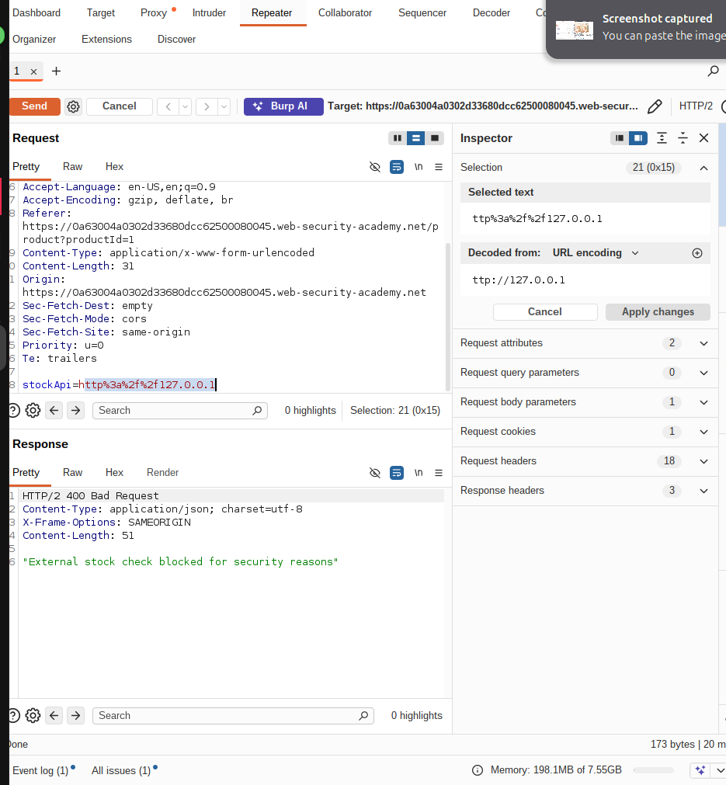
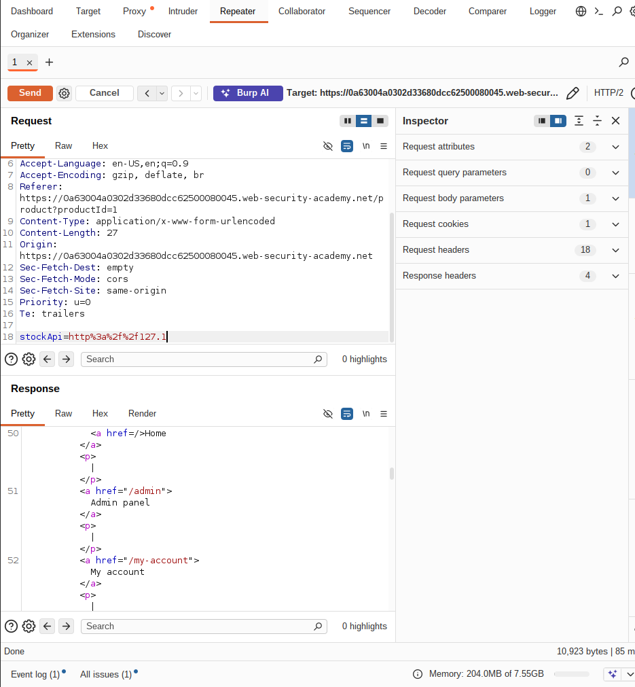
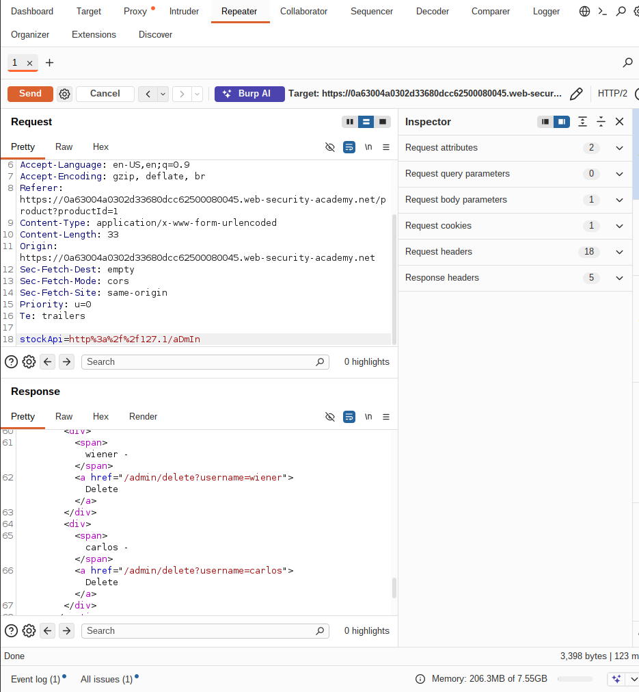
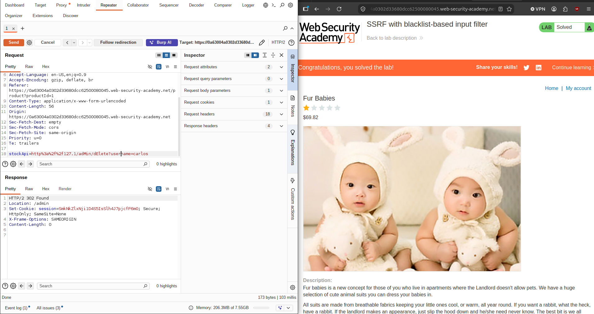

# PortSwigger - SSRF with Blacklist-Based Input Filter | Write-up

> **Platform:** PortSwigger &nbsp;•&nbsp; **Category:** Web Security / SSRF &nbsp;•&nbsp; **Difficulty:** Medium
>
> **Target:** `web (lab instance)` &nbsp;•&nbsp; **Time taken:** 15 mins
>
> **Author:** Jithin Jelson

---

## Introduction

This lab has a stock check feature which fetches data from an internal system. To solve the lab we have to delete the user named carlos. We have been made aware that the developer has two anti-SSRF defenses that you will need to bypass.

---

## Assessment Overview



---

## What I Learned

- How SSRF works when a server-side feature fetches a URL that the user supplies.
- Bypassing an IP blacklist using alternative representations of 127.0.0.1, like decimal, octal, and the short 127.1 form.
- Using case variation to slip a blocked path like /admin past a naive blacklist filter.
- Why blacklist-based input filters are fragile, because they only block the exact strings they already know about.
- Reading Burp Repeater responses to confirm when a payload actually reached the internal service.
- That chaining two small filter bypasses was enough to reach the admin panel and delete the target user.

---

## Finding the Stock Check Feature

So we can visit the web page with the stock check feature and fire up Burp.



*Figure 1 - The stock check request captured in Burp, showing the `stockApi` parameter that fetches from an internal system.*

---

## Defense 1 - localhost Is Blacklisted

When we try to direct the page to localhost we can see an error message popped up that prevents us from doing so.



*Figure 2 - Pointing `stockApi` at localhost returns an error, the first anti-SSRF defense blocking the request.*

---

## Bypassing Defense 1 - Alternative IP Representation

We can try and obfuscate this by using an alternative IP representation of 127.0.0.1, such as 2130706433, 017700000001, or 127.1.

```
stockApi=http://127.1/
```



*Figure 3 - Using 127.1 instead of 127.0.0.1 slips past the blacklist and reaches the internal service.*

Seems like that method worked so we can try and access the admin panel.

---

## Defense 2 - /admin Is Blacklisted, Bypass With Case Variation

However when we tried to access the admin panel we couldn't, so lets try and use case variation.

```
stockApi=http://127.1/ADMIN
```



*Figure 4 - The exact `/admin` path is blocked, but varying the case to `/ADMIN` bypasses the second defense and reaches the admin panel.*

---

## Deleting carlos and Solving the Lab

Seemed to work, now we can use the link to delete the user using case variation again.



*Figure 5 - Using the same case-variation trick on the delete link removes carlos, and the lab is marked solved.*

We successfully completed the lab.
