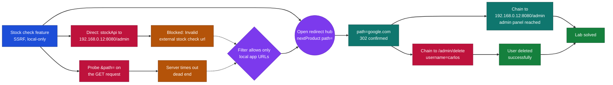
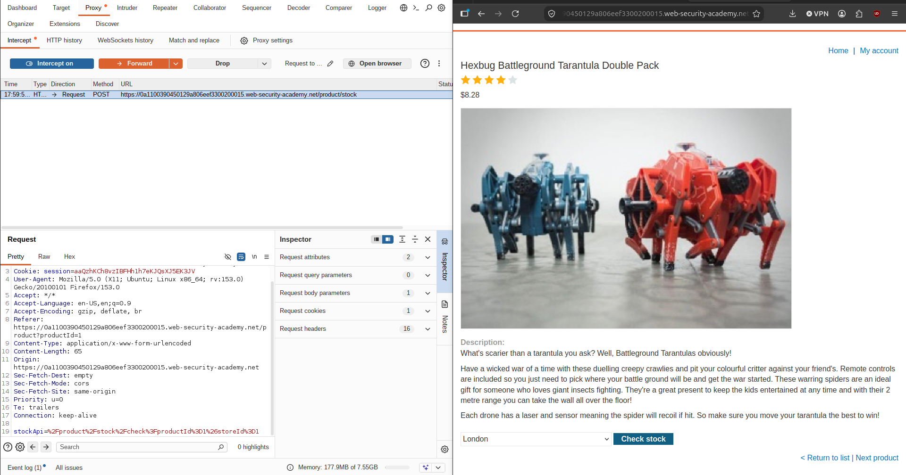
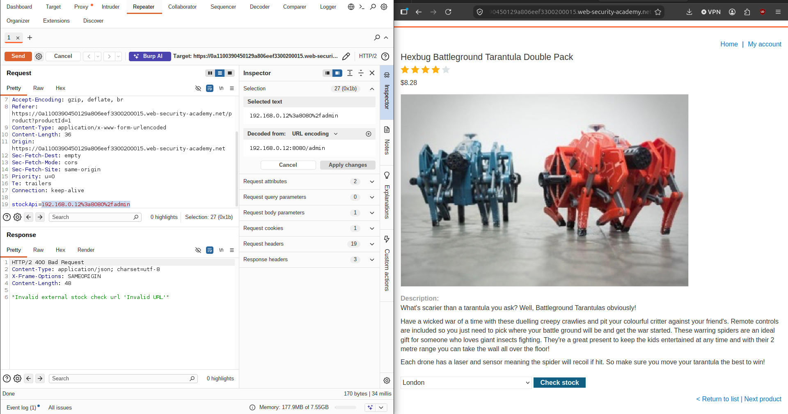
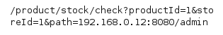
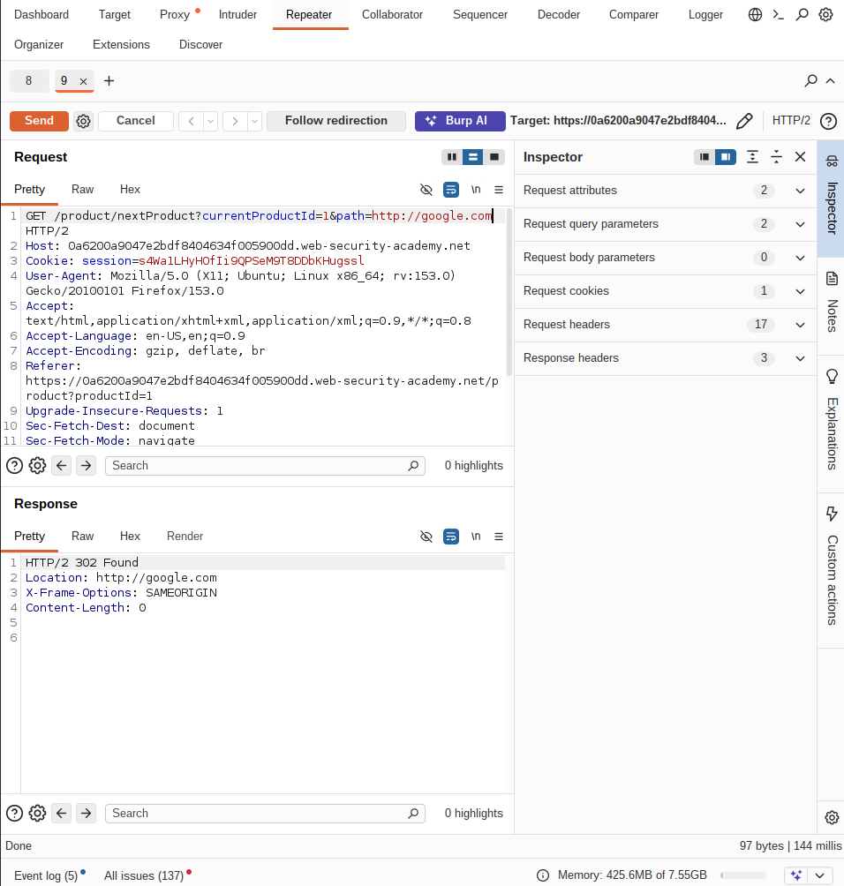
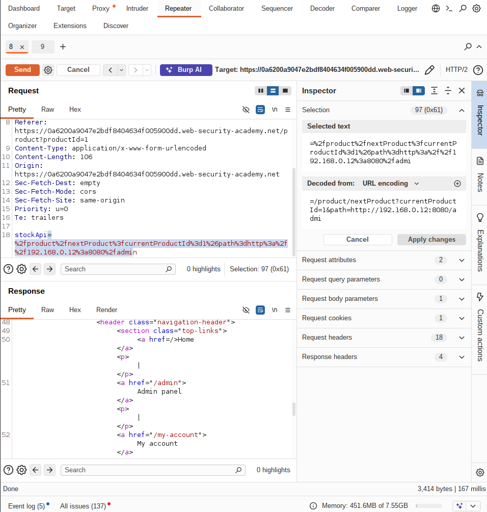
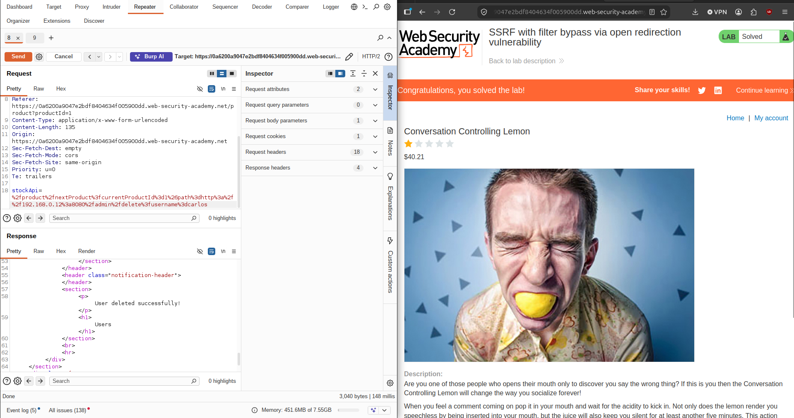

# PortSwigger - SSRF with Filter Bypass via Open Redirection | Write-up

> **Platform:** PortSwigger &nbsp;•&nbsp; **Category:** Web Security / SSRF &nbsp;•&nbsp; **Difficulty:** Practitioner
>
> **Target:** `web (lab instance)` &nbsp;•&nbsp; **Time taken:** 15 mins
>
> **Author:** Jithin Jelson

---

## Introduction

This lab has a stock check feature which fetches data from an internal system. To solve the lab we have been told to delete the user carlos from the admin panel located at 192.168.0.12:8080/admin. We have been told that the stock checker has been restricted to only the local application, so we will need to find an open redirect affecting the application first.

---

## Assessment Overview



---

## What I Learned

- How an SSRF filter that only allows local application URLs can still be bypassed if the app contains an open redirect.
- Why an open redirect is so useful here, since the server treats the redirecting URL as local but then follows it to an internal host.
- Finding an open redirect by feeding a path parameter an external URL like google.com and watching for a 302 response.
- Chaining the open redirect into the stockApi parameter to reach 192.168.0.12:8080/admin and delete the target user.

---

## Intercepting the Stock Check Feature

First we can start up Burp Suite and load up our target page.



*Figure 1 - The stock check request captured in Burp, with the `stockApi` parameter pointing at a relative `/product/stock/check` path on the local application.*

---

## Testing Direct Access to the Admin Panel

We test to see if we can access the 192.168.0.12:8080/admin panel directly first to see what response we get.

```
stockApi=http://192.168.0.12:8080/admin
```



*Figure 2 - Pointing `stockApi` straight at the internal admin host returns `400 Bad Request` with "Invalid external stock check url 'Invalid URL'", confirming the checker is restricted to the local application.*

---

## Attempting an Open Redirect

We can see that we get an invalid external stock check URL, so we can attempt an open redirect to see if we can bypass this. We will use &path=192.168.0.12:8080/admin.



*Figure 3 - Appending a `path` parameter aimed at the internal admin host, testing whether the application will redirect to it.*

Seems like the vulnerability isn't there, it could be in the GET request to the application. We also came across a next page button that has a path URL, and to test for the open redirect vulnerability we put google and we were successful.

```
GET /product/nextProduct?currentProductId=1&path=http://google.com
```



*Figure 4 - The `/product/nextProduct` endpoint takes a `path` parameter and responds with `302 Found` and `Location: http://google.com`, so we have a working open redirect.*

---

## Chaining the Open Redirect Into the SSRF

So my next thinking was we can use this URL in our vulnerable URL field in stockApi and try to access the admin panel from there, as it is a valid URL path.

```
stockApi=/product/nextProduct?currentProductId=1&path=http://192.168.0.12:8080/admin
```



*Figure 5 - Feeding `stockApi` the local `nextProduct` endpoint, which then redirects to `192.168.0.12:8080/admin`, passes the filter and reaches the internal admin panel (note the `/admin` link in the response).*

This time it seemed to work. We tried it initially on the GET request but the server timed out, maybe this was because that area wasn't vulnerable?

---

## Deleting carlos and Solving the Lab

And just like that we had solved the lab.

```
stockApi=/product/nextProduct?currentProductId=1&path=http://192.168.0.12:8080/admin/delete?username=carlos
```

**Answer:** `stockApi=/product/nextProduct?currentProductId=1&path=http://192.168.0.12:8080/admin/delete?username=carlos`



*Figure 6 - Extending the redirect target with `/admin/delete?username=carlos` deletes the user, the response confirms "User deleted successfully", and the lab is marked solved.*
